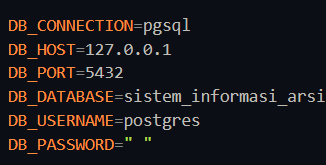
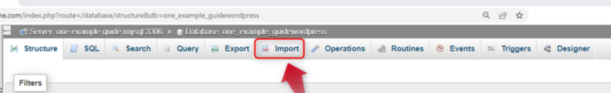

### Membuat Dokumentasi Penginstalan

1. Menginstal dependency dengan cara menjalankan perintah di terminal `composer update`

2. Mengubah terlebih dahulu file `.env.example` menjadi `.env` dan mengubah koneksi databasenya sesuai dengan server yang digunakan

3. Menjalankan perintah `php artisan key:generate` untuk menggenerate key baru

4. Mengimpor data dari file `sistem_informasi_arsip.sql` ke dalam php myadmin dengan cara memilih menu import dan pilih file `sistem_informasi_arsip.sql`

5. Menjalankan program dengan perintah `php artisan serve`
